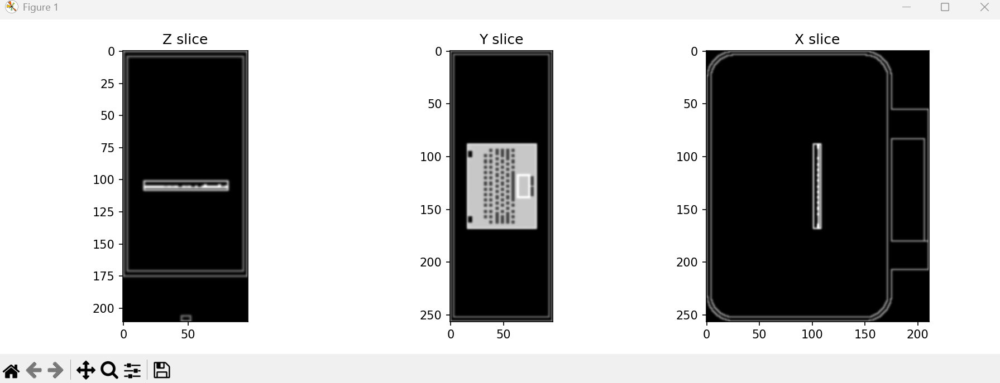
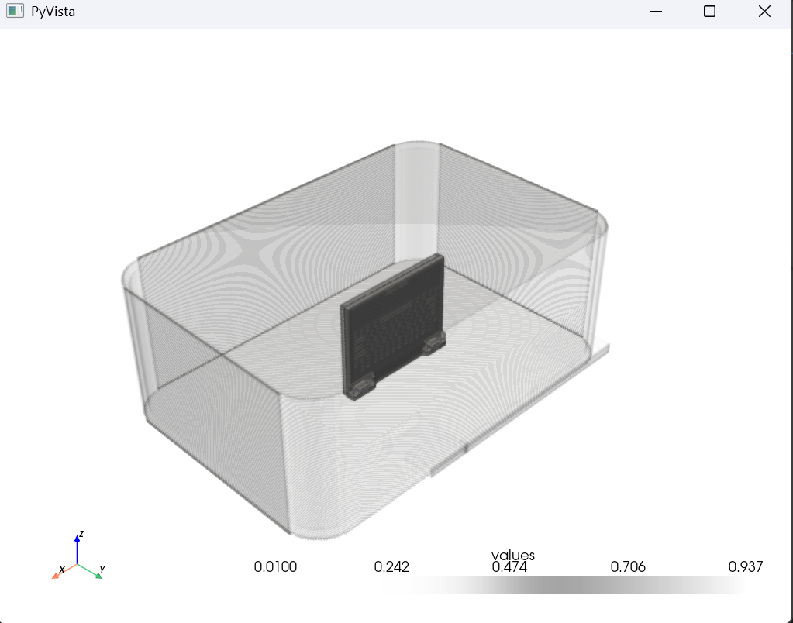
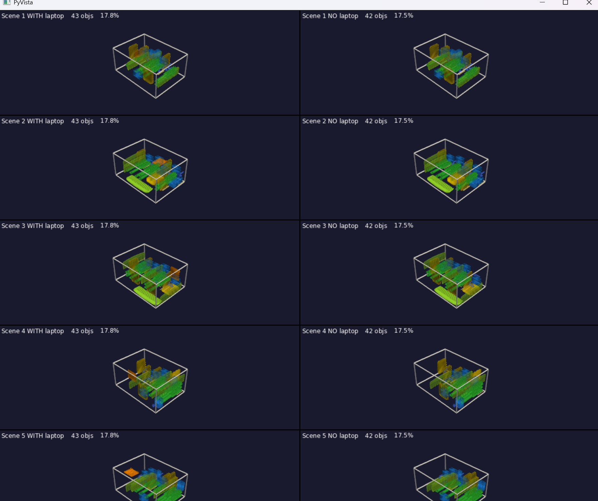

# Dependencies
pip install trimesh numpy scipy matplotlib nibabel pyvista

# Visualiser Testing
- visualiser.py = .stl -> voxels -> visualise
### Theory
- Input: .stl file which are basically meshes
Python codes: 
- lappy_case.py -> testing to view laptop inside the briefcase

- Randomise_lappy.py -> testing lappy in random orientations
- data_test.py -> Just visualising the objects before collecting the dataset
- shapes_tetris.py -> Generates n random scenes with and without laptop

TO DO
- folder structuring
- Dataset Creation